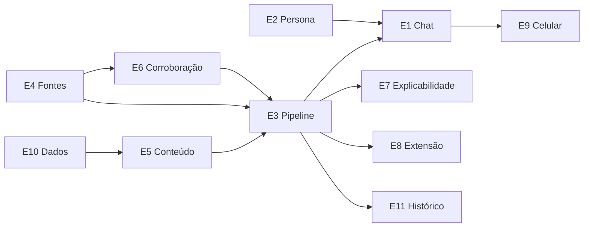

# Épicos

| Épico | Tema | Objetivo | Requisitos | Depende de | MVP |
| --- | --- | --- | --- | --- | --- |
| **E1 · Chat com a Vera** | T1 | Conversar com a Vera para checar uma notícia | RF-01 a RF-05 | E3 | :material-check: |
| **E2 · Persona e identidade visual** | T1 | Vera tematizada, colorida e animada | RF-04, RNF-08, RNF-20 | — | :material-check: |
| **E3 · Pipeline em camadas** | T2 | Orquestrar N0 a N4 com regra de parada | RF-06 a RF-11 | — | :material-check: |
| **E4 · Reputação de fontes** | T2 | Saber quem é confiável | RF-12 a RF-17 | — | :material-check: |
| **E5 · Análise de conteúdo** | T2 | Detectar sinais de falsidade na escrita | RF-18 a RF-23 | E10 | :material-check: |
| **E6 · Corroboração** | T2 | Saber se outros publicaram o mesmo e se as evidências sustentam | RF-24 a RF-28 | E4 | Parcial |
| **E7 · Explicabilidade** | T1 | Mostrar o porquê do resultado | RF-29 a RF-32, RNF-01 | E3 | :material-check: |
| **E8 · Extensão de navegador** | T3 | Vera dentro da página lida | RF-33 a RF-35 | E3, E4 | Parcial |
| **E9 · Celular** | T3 | Vera no celular | RF-36 a RF-39 | E1 | Parcial |
| **E10 · Dados e avaliação** | T4 | Datasets, métricas e calibração | RNF-06, RNF-07 | — | :material-check: |
| **E11 · Histórico e últimas notícias** | T1 | Memória das checagens | RF-40, RF-41 | E3 | Não |

## Mapa de dependências

!!! tip "Leitura do mapa"
    **E10, E4 e E2** não dependem de nada e podem começar em paralelo na primeira Sprint
    da fase Act.
