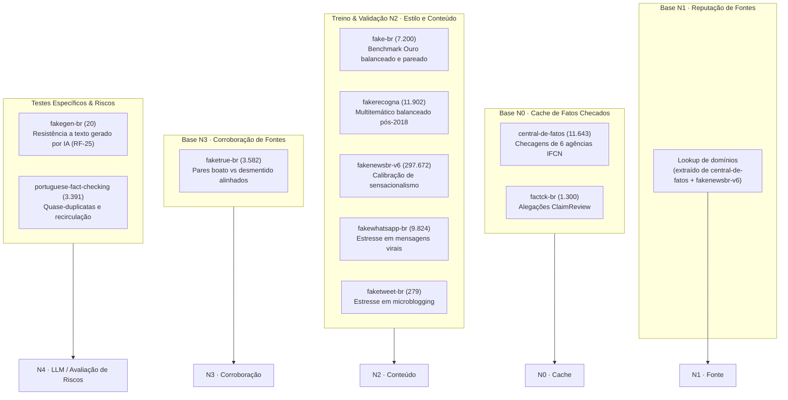

# Alocação e Justificativas dos Datasets na Arquitetura

??? abstract "Histórico de revisão"

    | Data | Versão | Descrição | Autor |
    | :---: | :---: | --- | --- |
    | 21/09 | 1.0 | Criação da página com a fundamentação e mapeamento dos 11 datasets no pipeline da Vera | Ian Costa, Luísa Brambilla, Maykon Soares, Natália Evelin, Rebeca Bontempo |

Esta página detalha a **estratégia de uso dos 11 datasets padronizados** no produto **Vera**. Ela fundamenta o porquê de cada base ter sido alocada em sua respectiva camada no pipeline de checagem ([Como a Vera funciona](produto/funcionamento.md)), quais problemas cada uma resolve e os **riscos metodológicos** de utilizá-las fora do escopo planejado.

---

## Princípio arquitetural: investigação progressiva

A Vera não trata a detecção de fake news como uma classificação monolítica (*"jogar todo o texto em um modelo e esperar uma resposta"*). O produto segue uma **esteira de decisão em camadas**, escalonando custos computacionais e financeiros da verificação mais barata até a mais complexa:



---

## Justificativa por camada da Vera

### 1. Camada N0 · Cache de Fatos & Checagens Pré-Existentes

!!! info "Objetivo da camada"
    Responder em menos de 200 ms se a alegação já foi formalmente checada e desmentida por uma agência oficial de checagem de fatos, aplicando a regra prioritária **RN-01** com custo zero de LLM.

| Dataset | Volume | Por que foi escolhido aqui? | Por que NÃO usar em outra etapa? |
| :--- | :--- | :--- | :--- |
| **`central-de-fatos`** | 11.643 linhas | Reúne o histórico de checagens de **seis agências signatárias do IFCN** (Lupa, Aos Fatos, Boatos.org, Fato ou Fake, Estadão Verifica e Comprova). Se a entrada do usuário tiver alta similaridade com uma checagem existente, a Vera responde de imediato citando a agência. | **Inadequado para treinar ML de estilo (N2)**: mais de 87% da base é de falsos e o texto reflete a redação jornalística dos checadores. O modelo aprenderia o linguajar da agência, e não as marcas da desinformação. |
| **`factck-br`** | 1.300 linhas | Base construída no padrão **ClaimReview** (o mesmo padrão estruturado da Google Fact Check Tools API). Traz o resumo exato da alegação checada, permitindo busca vetorial rápida por similaridade semântica. | Amostra reduzida (1.300 registros) e rótulos em escala fina ("Exagerado", "Distorcido", "Sem contexto") que dificultam classificação binária direta. |

---

### 2. Camada N1 · Fonte e Reputação de Veículos

!!! info "Objetivo da camada"
    Avaliar quem publicou a matéria e se o domínio possui histórico recente de notícias falsas confirmadas ([RF-14](requisitos/funcionais.md), [RF-18](requisitos/funcionais.md), sinais S-01 e S-02).

| Dataset | Volume | Por que foi escolhido aqui? | Por que NÃO usar em outra etapa? |
| :--- | :--- | :--- | :--- |
| **`central-de-fatos`** *(metadados)* | ~11.600 URLs | Ao cruzar as fontes e links citados nos desmentidos, extrai-se a relação quantitativa de domínios com desinformação comprovada nos últimos meses (alimentando o sinal S-02). | Os metadados de domínio servem para lookup de reputação; o texto da checagem em si é utilizado em N0. |
| **`fakenewsbr-v6`** *(metadados)* | ~297.000 URLs | Traz campos ricos de metadados como `source_description`, `url_review` e `factcheck_url`. É a maior fonte disponível para mapear os domínios legítimos da imprensa brasileira vs sites falsificados ou obscuros. | Volume extenso demais para busca semântica em tempo de inferência online; seu uso ideal é offline, compilando a base estruturada de fontes (`fontes_reputacao.json`). |

---

### 3. Camada N2 · Conteúdo e Estilo (ML Clássico e Heurísticas)

!!! info "Objetivo da camada"
    Identificar padrões linguísticos e comportamentais de desinformação (estilometria, apelo emocional, sensacionalismo) rodando localmente em CPU em menos de 100 ms ([RF-21](requisitos/funcionais.md), [RF-22](requisitos/funcionais.md), sinais S-06 e S-07).

#### A) Treino Principal do Classificador Estilístico (S-06 / RF-21)
| Dataset | Volume | Por que foi escolhido aqui? | Por que NÃO usar em outra etapa? |
| :--- | :--- | :--- | :--- |
| **`fake-br`** | 7.200 linhas | **Referência metodológica em língua portuguesa.** Possui balanceamento exato (50% fake, 50% true) e **pareamento temático rigoroso**: para cada notícia falsa, há uma verdadeira cobrindo o mesmo evento. Isso impede o classificador de aprender viés de assunto (*topic bias*), focando estritamente no **estilo de escrita**. | Deve ser mantido limpo e isolado como base do conjunto de teste oficial ([RNF-06](requisitos/nao-funcionais.md)). Não deve ser mesclado indiscriminadamente com bases desbalanceadas. |
| **`fakerecogna`** | 11.902 linhas | Perfeitamente balanceado (5.951 falsas / 5.951 verdadeiras) e multitemático (política, saúde, economia). Expande o vocabulário para além das eleições de 2018 do `fake-br`, trazendo notícias até 2021. | Atenção à rotulação original invertida (Classe 0 = falsa, Classe 1 = verdadeira), já padronizada no Parquet. |

#### B) Calibração de Heurísticas de Sensacionalismo (S-07 / RF-22)
| Dataset | Volume | Por que foi escolhido aqui? | Por que NÃO usar em outra etapa? |
| :--- | :--- | :--- | :--- |
| **`fakenewsbr-v6`** *(atributos)* | 297.672 linhas | Já traz da origem métricas de estilo pré-calculadas (frequência de exclamações `!`, interrogações `?`, reticências `...` e taxa de caixa alta). Permite calibrar empiricamente as curvas de sensacionalismo em quase 300 mil textos. | **Proibido usar como treino supervisionado do texto bruto**: possui desbalanceamento de 3,5 verdadeiras para cada 1 falsa e **incorpora 7.160 notícias copiadas do `fake-br`**. Treinar nele e avaliar no `fake-br` causaria vazamento brutal de dados (*data leakage*). |

#### C) Avaliação de Robustez em Outros Canais (WhatsApp e Twitter)
| Dataset | Volume | Por que foi escolhido aqui? | Por que NÃO usar em outra etapa? |
| :--- | :--- | :--- | :--- |
| **`fakewhatsapp-br`** | 9.824 mensagens | Único corpus de mensagens virais de WhatsApp em PT-BR com rotulação (2018 e 2020). Serve para testar se o classificador N2 mantém acurácia quando o usuário envia mensagens curtas e informais no chat da Vera. | Não deve entrar no treino inicial de notícias formais: mensagens de bate-papo não possuem a estrutura sintática de parágrafos jornalísticos, gerando ruído nos n-gramas. |
| **`faketweet-br`** | 279 tweets | Corpus rotulado de microblogging (280 caracteres) com dados de engajamento (retweets e favoritos). | Volume muito pequeno (279 amostras): treiná-lo causaria *overfitting* imediato. Serve para teste exploratório. |

---

### 4. Camada N3 · Corroboração de Fatos e Evidências Cruzadas

!!! info "Objetivo da camada"
    Verificar se veículos legítimos cobriram o mesmo evento e identificar cópias com fatos adulterados ([RF-27](requisitos/funcionais.md), [RF-28](requisitos/funcionais.md), [RF-31](requisitos/funcionais.md), sinais S-11 e S-13).

| Dataset | Volume | Por que foi escolhido aqui? | Por que NÃO usar em outra etapa? |
| :--- | :--- | :--- | :--- |
| **`faketrue-br`** | 3.582 notícias | Cada linha traz o **par alinhado**: o boato apurado pelo Boatos.org e a matéria legítima correspondente do G1 ou Folha cobrindo o mesmo fato. É o benchmark pronto para validar os algoritmos de busca semântica e correspondência cruzada. | **Não usar em N2**: na estruturação dos pares, a mesma notícia verdadeira aparece associada a múltiplos boatos. Treinar N2 nela duplicaria artificialmente os textos verdadeiros. |
| **`portuguese-fact-checking`** | 3.391 publicações | Mapeia publicações de redes sociais conectadas à alegação checada, trazendo quase-duplicatas e desinformação sobre COVID-19. Ideal para testar o agrupamento de boatos requentados. | Desbalanceamento severo no recorte MuMiN-PT (1.343 falsas para apenas 61 verdadeiras), o que inviabiliza o treino tradicional de classificadores. |

---

### 5. Camada N4 · Casos Complexos e IA Generativa

!!! info "Objetivo da camada"
    Resolver notícias plausíveis e bem-escritas que escapam às camadas anteriores, empregando LLMs para decompor alegações e inferir suporte ou contradição contra evidências (NLI).

| Dataset | Volume | Por que foi escolhido aqui? | Por que NÃO usar em outra etapa? |
| :--- | :--- | :--- | :--- |
| **`fakegen-br`** | 20 notícias | 20 notícias falsas geradas por LLM (GPT-4.1-mini) a partir de notícias reais do `fake-br`. Serve exclusivamente como **conjunto de teste cego para o requisito [RF-25](requisitos/funcionais.md)**: avaliar se a Vera resiste a desinformações sintéticas de gramática perfeita. | Amostra minúscula (20 itens) e de origem 100% artificial: estatisticamente inválido para treino ou métricas gerais de acurácia. |
| **`fktc`** | 460 MB | Recorte denso de notícias políticas checadas por agências durante o ciclo eleitoral de 2018/2019. Serve para estresse temático na fase de refinamento. | Download pesado opcional no Zenodo que inclui bases internacionais; fica reservado para testes aprofundados (`--completo`). |

---

## Critérios para o Benchmark Oficial (RNF-06)

O requisito [RNF-06](requisitos/nao-funcionais.md) exige meta explícita para o MVP:

$$\mathbf{F_1\text{-macro} \ge 0,80}$$

Para assegurar validade científica e ausência de viés na medição:

1. **Partição Intocada (Golden Set):** Deve ser reservada uma partição de teste estratificada de 20% do **`fake-br`** (720 falsas e 720 verdadeiras) e/ou do **`fakerecogna`**.
2. **Isolamento Absoluto:** Esse conjunto não deve participar de ajuste de hiperparâmetros, vetorização TF-IDF ou calibração de pesos.
3. **Prevenção de Vazamento (*Data Leakage*):** O dataset `fakenewsbr-v6` não deve ser utilizado como treino se o teste for no `fake-br` sem a prévia remoção das 7.160 linhas compartilhadas.

---

## Matriz resumo de decisão

```
datasets/
├── central-de-fatos        ──► N0 (Cache de checagens) & N1 (Histórico de domínios)
├── factck-br               ──► N0 (Alegações estruturadas ClaimReview)
├── fake-br                 ──► N2 (Treino de estilo) & RNF-06 (Benchmark oficial)
├── fakerecogna             ──► N2 (Treino multitemático pós-2018)
├── fakenewsbr-v6           ──► N1 (Reputação de fontes) & N2 (Calibração de sensacionalismo)
├── fakewhatsapp-br         ──► N2 (Teste de robustez em mensagens virais)
├── faketweet-br            ──► N2 (Teste exploratório em microblogging)
├── faketrue-br             ──► N3 (Benchmark de corroboração e pares alinhados)
├── portuguese-fact-checking──► N3 (Detecção de quase-duplicatas)
├── fakegen-br              ──► N4 (Teste de resistência a texto por IA - RF-25)
└── fktc                    ──► Validação de estresse em ciclo eleitoral
```

