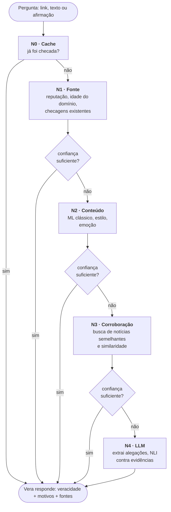
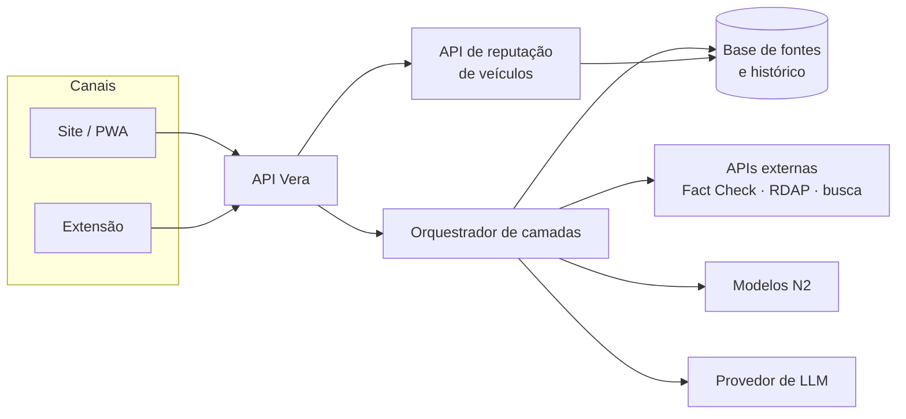

# Como a Vera funciona

??? abstract "Histórico de revisão"

    | Data | Versão | Descrição | Autor |
    | :---: | :---: | --- | --- |
    | 16/09 | 1.0 | Criação da página | Maykon Soares |

!!! danger "Proposta para validar"
    A arquitetura abaixo é a **proposta inicial** do grupo. Os limiares e as camadas
    precisam ser validados com dados na fase Investigate.

## Princípio: escalonar o custo

Nem toda notícia precisa de uma LLM. Uma notícia de um site criado há três dias, que
nenhum veículo publicou e que já foi desmentida por uma agência de checagem, é resolvida
**sem IA generativa**.

A Vera verifica em **camadas** que vão da mais barata para a mais cara. Depois de cada
camada ela calcula a veracidade e a **confiança** no resultado. Se a confiança já for
suficiente, ela **para e responde**. Se não for, sobe para a próxima camada.

## Camadas

| Camada | O que faz | Técnica | Custo | Latência alvo |
| --- | --- | --- | --- | --- |
| **N0 · Cache** | Reaproveita checagens já feitas da mesma URL ou afirmação | Hash da URL normalizada, similaridade de texto | Nenhum | < 200 ms |
| **N1 · Fonte** | Avalia **quem** publicou | Base de fontes curada, RDAP/WHOIS, Google Fact Check Tools API, histórico de fakes do domínio | Muito baixo (consulta a APIs) | < 2 s |
| **N2 · Conteúdo** | Avalia **como** está escrito | TF-IDF + SVM / Regressão Logística / Random Forest, heurísticas de estilo, NRC Emotion Lexicon | Baixo (CPU) | < 1 s |
| **N3 · Corroboração** | Verifica se **outros** publicaram o mesmo | Busca de notícias (GDELT, API de busca, RSS de veículos), *embeddings* para similaridade | Médio | < 8 s |
| **N4 · LLM** | Resume, extrai alegações e confere contra as evidências | LLM + NLI (sustenta / contradiz / neutro) | Alto (tokens) | < 20 s |

## Dificuldade da notícia

A camada em que a Vera parou define a **dificuldade** da checagem. O dado é útil para
métricas de custo e para calibrar os limiares:

| Dificuldade | Resolvida em | Exemplo |
| --- | --- | --- |
| :material-circle:{ style="color: #2e7d32" } **Fácil** | N0 ou N1 | Já desmentida por uma agência; site criado há uma semana |
| :material-circle:{ style="color: #f9a825" } **Mediano** | N2 ou N3 | Texto sensacionalista que nenhum veículo confiável replicou |
| :material-circle:{ style="color: #c62828" } **Difícil** | N4 | Notícia plausível, bem escrita, com meia-verdade ou contexto distorcido |

## Regra de parada

Depois de cada camada:

1. calcular o **score de veracidade** `V` (0 a 100) com os sinais disponíveis até ali (ver
   [Classificação](classificacao.md#formula));
2. calcular a **confiança** `C` (0 a 1): quanto do peso total já foi observado e se os
   sinais concordam entre si;
3. **parar** se `C ≥ C_min` **e** `V` estiver fora da zona de dúvida (`V ≤ 25` ou `V ≥ 75`);
4. **parar sempre** se existir checagem de agência signatária da IFCN (regra
   [RN-01](../requisitos/regras-de-negocio.md));
5. caso contrário, subir de camada.

!!! tip "Valores iniciais sugeridos"
    `C_min = 0,7`. A zona de dúvida (26 a 74) deve ser recalibrada com o dataset de
    avaliação ([US-10.3](../backlog/historias.md#e10-dados-e-avaliacao)).

## Modelo de baixo custo × alto custo

O brainstorm pediu dois modelos. Na arquitetura em camadas eles viram **modos de operação**
do mesmo pipeline:

| | Modo econômico | Modo completo |
| --- | --- | --- |
| Camadas | N0 a N3 | N0 a N4 |
| Usa LLM | Não | Só quando as camadas anteriores não bastam |
| Explicação | Montada por *templates* com as frases da Vera | Gerada pela LLM na voz da Vera, com as evidências |
| Uso previsto | Extensão (selo do site), plano gratuito, fallback se a LLM cair | Chat, notícias difíceis |

## Arquitetura de alto nível

A **API de reputação de veículos** é um produto em si: responde "este domínio é
confiável?" e serve à extensão (selo), ao chat e, no futuro, a terceiros.
